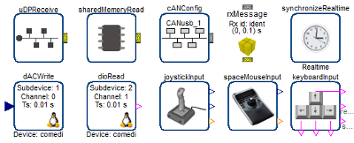

# Modelica_DeviceDrivers

Free library for interfacing hardware drivers to Modelica models.
There is support for joysticks, keyboards, UDP, TCP/IP, LCM, MQTT, shared memory, AD/DA converters, serial port and other devices.

## Library description

The `Modelica_DeviceDrivers` (MDD) library is an open source Modelica package that interfaces hardware drivers to Modelica models. An overview of the library is provided in

> Bernhard Thiele, Thomas Beutlich, Volker Waurich, Martin Sjölund, and Tobias Bellmann, Towards a Standard-Conform, Platform-Generic and Feature-Rich Modelica Device Drivers Library. In Jiří Kofránek and Francesco Casella, editors, _12th Int. Modelica Conference_, Prague, Czech Republic, May 2017. [Download](https://www.modelica.org/events/modelica2017/proceedings/html/submissions/ecp17132713_ThieleBeutlichWaurichSjolundBellmann.pdf)

The library unifies previous developments concerning device driver support in Modelica, see [Interactive Simulations and advanced Visualization with Modelica](https://ep.liu.se/ecp/043/062/ecp09430056.pdf) and [Modelica for Embedded Systems](https://ep.liu.se/ecp/043/040/ecp09430096.pdf) (Modelica'2009 conference). The functionality covered by this library has been used internally at DLR for several years, such as for Driver-in-the-Loop simulation and for the [DLR Robot Motion Simulator](http://www.dlr.de/media/en/desktopdefault.aspx/tabid-4995/8426_read-17606/).
The previously fragmented functionality was streamlined, improved, and extended to a coherent cross-platform library.

Main features:
  * Cross-platform (Windows and Linux).
  * (Soft) real-time synchronization of a simulation.
  * Support for keyboard, joystick/gamepad, and 3Dconnexion Spacemouse.
  * Support for a universal packaging concept to pack Modelica variables in a graphical and convenient way into a bit vector and transport such a bit vector via UDP, TCP/IP, LCM, MQTT, serial I/O or shared memory (CAN support is prototypical available).
  * Support of the Linux control and measurement device interface for digital and analog I/O (Comedi interface).

All device drivers are made available via external Modelica functions. Furthermore, high level interfaces on these functions are provided via Modelica blocks. The first interface uses Modelica 3.2 functionality only (when-clauses and sample-operator).
The second interface uses the synchronous language elements introduced in Modelica 3.3 and is based on clocks.



### Self-certification
 - [X] Internationalized
 - [ ] Unit tests
 - [X] End-user documentation
 - [X] Internal documentation (documentation, interfaces, etc.)
 - [X] Existed and maintained for at least 6 months

## Build status

[](https://app.travis-ci.com/modelica-3rdparty/Modelica_DeviceDrivers)

## Current release

Download [Modelica_DeviceDrivers latest release](../../releases/latest)

Please note that the library is known to work with
* Dymola,
* SimulationX (with `userBufferSize` all non-clocked communication blocks are working in SimulationX, but `autoBufferSize` only works for external solvers CVode and Fixed Step solver and fails for BDF and MEBDF solvers, see [#54 (comment)](https://github.com/modelica-3rdparty/Modelica_DeviceDrivers/issues/54#issuecomment-76032325)),
* OpenModelica (partial support, e.g., UDP, serial port, shared memory, LCM, keyboard).

If you tested the library successfully with another Modelica tool, please contact [Bernhard Thiele](https://github.com/bernhard-thiele) or send a [pull request](https://github.com/modelica-3rdparty/Modelica_DeviceDrivers/pulls) that updates this README.md.

#### Release notes

Bug fix releases may not have release notes, so please use the download link from above to get the latest release including bug fixes.

* [Version v2.1.0 (2022-08-10)](../../releases/tag/v2.1.0)
  * Enhancements:
    * Added parameter `useRecvThread` also for _clocked_ `UDPReceive` variant (#342).
    * Added option for not unlinking shared memory partition at process termination (#339).
    * Updated 3rd-parth library paho.mqtt.c to v1.3.10 (#355).
  * Bug fixes:
    * Fixed sporadic `RealtimeSynchronize` block "clock_nanosleep" error on Linux (#357).
    * Fixed `MDD_TCPIPServer_Send(...)` return value, so that it works as described in the documentation: "On success, return the number of bytes sent, 0 if operation would block, -1 on non-fatal error" (#323).
    * Serial port interface on Windows: Fixed spurious byte sent at the end of a simulation (#352).
* [Version v2.0.0 (2020-06-08)](../../releases/tag/v2.0.0)
  * Migrated from Modelica Standard Library 3 (MSL 3) to MSL 4 -> _Non-backwards compatible release!_
  * However, apart from the MSL 4 dependency this release is compatible to previous releases and no update of user libraries is necessary apart from migrating to MSL 4.
  * Enhancements:
    * Added all license files to better assist tool vendors in distribution of source or binary files (#313).
    * Updated 3rd-party library paho.mqtt.c to v1.3.4 (#320).
  * Bug fixes:
    * Fixed small issues in the SBHS Board example (#318).
* [Version v1.8.2 (2020-03-26)](../../releases/tag/v1.8.2)
  * Updated Linux MQTT binary dependencies. The updated libraries are compiled with the `-fPIC` flag, which fixes a related FMU generation problem (#306).

For information about previous releases, see [Release Notes of Previous Versions](ReleaseNotesPreviousVersions.md).

## Citing

Use the following BibTeX lines to cite the Modelica_DeviceDrivers library

```
@InProceedings{modelica2017mdd,
  Title = {Towards a Standard-Conform, Platform-Generic and Feature-Rich Modelica Device Drivers Library},
  Author = {Thiele, Bernhard and Beutlich, Thomas and Waurich, Volker and Sjölund, Martin and Bellmann, Tobias},
  Booktitle = {Proceedings of the 12th International Modelica Conference},
  Year = {2017},
  Address = {Prague, Czech Republic},
  Editor = {Kofránek, Jiří and Casella, Francesco},
  Month = may,
  Pages = {713--723},
  Doi = {10.3384/ecp17132713},
}
```

## License

This Modelica package is free software and the use is completely at your own risk;
it can be redistributed and/or modified under the terms of the [BSD-3-Clause License](LICENSE).

## Development and contribution

The master branch of the Modelica_DeviceDrivers library should work out-of-the-box when loading the library into a supporting Modelica tool. The branch contains the necessary external C libraries as pre-build binaries below folder [Modelica_DeviceDrivers/Resources/Library](Modelica_DeviceDrivers/Resources/Library).

If you need to build the external C libraries from the sources, clone the repository with

```git
git clone --recursive https://github.com/modelica-3rdparty/Modelica_DeviceDrivers.git
git submodule update --init --recursive
```

and see [Modelica_DeviceDrivers/Resources/README.md](Modelica_DeviceDrivers/Resources/README.md).

Main developers:
* [Bernhard Thiele](https://github.com/bernhard-thiele), release management, Linux specific code, etc.
* [Thomas Beutlich](https://github.com/beutlich), SimulationX support, new features, Windows specific code, etc.
* [Tobias Bellmann](https://github.com/tbellmann), most of the initial MS Windows specific code.

You may report any issues with using the [Issues](https://github.com/modelica-3rdparty/Modelica_DeviceDrivers/issues) button.

Contributions in shape of [Pull Requests](https://github.com/modelica-3rdparty/Modelica_DeviceDrivers/pulls) are always welcome.

The following people have directly contributed to the implementation of the library (many more have contributed by providing feedback and suggestions):
* [Miguel Neves](https://github.com/ChukasNeves), human readable error codes for the Softing CAN interface.
* Dominik Sommer, code for Linux serial port support.
* [Rangarajan Varadan](http://www.codeproject.com/Members/Rangarajan-Varadan), [code for Windows serial port support](http://www.codeproject.com/Articles/81933/Serial-Port-R-W-With-Read-Thread).
* [Dietmar Winkler](https://github.com/dietmarw), GitHub project setup, development services integration etc.
* [Martin Sjölund](https://github.com/sjoelund), `EmbeddedTargets.AVR` support.
* [Lutz Berger](https://github.com/it-cosmos), `EmbeddedTargets.STM32F4` (experimental) support.
* And several more contributed bug fix PRs etc.
